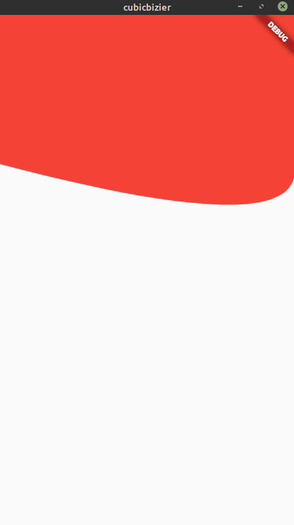

# Cubic bezier

  Warning: here we use coordinates 2d in Cartesian plan, which we define point on plan.

## Overview

Using quadratic bezier and cubic bezier in flutter with custom paint.

  

## Explanation

### Quadratic cubic bezier has three points:
  

  - the first point is (0, 0)(added by default);
  - the second point is (endPointX, endPointY);
  - the third point is (controllerPointX, controllerPointY);

### Cubic bezier has four points:
  

  
  - the first point is (0, 0)(added by default);
  - the second point is (endPointX, endPointY)
  - the third point is (controllerPointX1, controllerPointY1)
  - the fourth point is (controllerPointX2, controllerPointY2)
  

  

